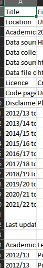

# Basic data scrape and comparison
The code below will read a CSV from the student open data as a Pandas dataframe

nb: storage_options is an optional variable to include, the code will likely run without it but may be required for running on non Jisc laptops. It is a dictionary type containing some browser metadata to "spoof" a web browser.

```python
import pandas as pd
url = 'https://www.hesa.ac.uk/data-and-analysis/sb265/figure-1.csv'
storage_options = {'User-Agent': 'Mozilla/5.0'}
pd.read_csv(url, storage_options=storage_options, skiprows=22)
```

HESA's open data prepends a metadata section above the open data in CSVs. skiprows=22 removes this, the value of skiprows will need to change dependent on how many years of data the CSV contains.
Bulletins are typically a fixed 5 or 10 years where the data is available, so number of rows to skip will be consistent. This is not the case for open data.
See the example below of what the metadata looks like. The "real" data starts with 'Academic year'.



To view the number of rows in Python, import the data with no row skip, then run 
```python
df1.head(30)
# 30 is the number of rows to show as a preview, it can be any number or excluded to return the default of 5.
```

As the purpose of this code is to compare two HESA datasets, it is advised to create a simple function to read this data, rather than repeat the code block.

```python
def get_hesa_csv(url, skip):
    storage_options = {'User-Agent': 'Mozilla/5.0'}
    return pd.read_csv(url, storage_options=storage_options, skiprows=skip)

df1 = get_hesa_csv('https://www.hesa.ac.uk/data-and-analysis/sb265/figure-1.csv', skip=23)
# This is figure 1 of the HESA student bulletin for the 2021/22 academic year
```

To import another dataset, simply change the URL in the function call, optionally, the rows to skip

```python
df2 = get_hesa_csv('https://www.hesa.ac.uk/data-and-analysis/sb262/figure-1.csv', skip=23)
# This is figure 1 of the HESA student bulletin for the 2020/21 academic year
```

There should now be two dataframes: df1, df2. The number of rows in each should be identical as each contains the same number of academic years (10) and variable values (level of study).
```python
merged = pd.merge(df1, df2,
                  how='outer',
                  left_on = ['Academic year', 'Level of study'], 
                  right_on = ['Academic year', 'Level of study'])
merged['diff'] = merged['Number_x'].fillna(0) - merged['Number_y']. fillna(0)

differences = merged[merged['diff'] != 0]

print(differences)
```
