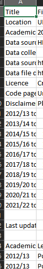

# Basic data scrape and comparison
Pandas is the best library to use for data manipulation in Python.
It offers a number of easy to use features and structures the data in an easy to work with format.
The main data structures of Pandas are dataframes (think an Excel spreadsheet), dataframes are constructed of series (think columns of a spreadsheet). Rows can be referred to as index/indices, these start at 0 by default. Caution though that Pandas dataframes can use column indexing, i.e. to return column 2 of a dataframe, one could use ```df1.iloc[:, 1]``` where:
    "iloc" is index location, 
    "[:" means return all rows (a number before the colon would return a set number of rows)
    ", 1" returns column 2 of the dataframe where the first column is 0.

The code below will read a CSV from the student open data as a Pandas dataframe
```python
import pandas as pd
url = 'https://www.hesa.ac.uk/data-and-analysis/sb265/figure-1.csv'
storage_options = {'User-Agent': 'Mozilla/5.0'}
pd.read_csv(url, storage_options=storage_options, skiprows=22)
```
NB: storage_options is an optional variable to include, the code will likely run without it but may be required for running on non Jisc laptops. It is a dictionary type containing some browser metadata to "spoof" a web browser.


HESA's open data prepends a metadata section above the open data in CSVs. skiprows=22 removes this, the value of skiprows will need to change dependent on how many years of data the CSV contains.
Bulletins are typically a fixed 5 or 10 years where the data is available, so number of rows to skip will be consistent. This is not the case for open data.
See the example below of what the metadata looks like. The "real" data starts with 'Academic year'.



To view the number of rows in Python, import the data with no row skip, then run 
```python
df1.head(30)
# 30 is the number of rows to show as a preview, it can be any number or excluded to return the default of 5.
```

As the purpose of this code is to compare two HESA datasets, it is advised to create a simple function to read this data, rather than repeat the code block.

```python
def get_hesa_csv(url, skip):
    storage_options = {'User-Agent': 'Mozilla/5.0'}
    return pd.read_csv(url, storage_options=storage_options, skiprows=skip)

df1 = get_hesa_csv('https://www.hesa.ac.uk/data-and-analysis/sb265/figure-1.csv', skip=23)
# This is figure 1 of the HESA student bulletin for the 2021/22 academic year
```

To import another dataset, simply change the URL in the function call, optionally, the rows to skip

```python
df2 = get_hesa_csv('https://www.hesa.ac.uk/data-and-analysis/sb262/figure-1.csv', skip=23)
# This is figure 1 of the HESA student bulletin for the 2020/21 academic year
```

There should now be two dataframes: df1, df2. The number of rows in each should be identical as each contains the same number of academic years (10) and variable values (level of study).

Now to compare the data.
It's worth noting that as the datasets are from two separate (rolling) years, the first academic year of df1 and the last year of df2 will not appear in the other dataset.

Pandas' merge function allows dataframes to be combined on matching variable values.
In this case, the shared variables between the datasets are 'Academic year' and 'Level of study', the third column of the data being value, which we want to exclude here to be able to see the differences on a row-by-row level.
Feed in the shared variables as a list [ ] into the function. State the method of matching, similar to SQL, 'outer' will display data from both datasets, whether the data is in both dataframes or not.
Adding the "indicator=True" argument appends a column to the output noting: whether the matches appear in both datasets 'both', the first one 'left_only' or the second 'right_only'.

```python
merged = pd.merge(df1, df2,
                  how='outer',
                  left_on = ['Academic year', 'Level of study'], 
                  right_on = ['Academic year', 'Level of study'],
                  indicator=True)
```
The output dataset would have two value columns, _x and _y. The first being the values of df1, the second df2. Where there are mismatches, the values will be NaN.

To view the differences clearly, a column showing the differences can be added. The mismatched NaN rows here are filled with 0s. Not doing so would display NaN in the differences column as Pandas does not perform calculations on NaN values.
```python
merged['diff'] = merged['Number_x'].fillna(0) - merged['Number_y']. fillna(0)
```
Finally, to view only the non-matches as a separate dataframe, the differences column can be filtered to non-zero values.

```python
differences = merged[merged['diff'] != 0]
```

The full code from the above is:
```python
import pandas as pd

def get_hesa_csv(url, skip):
    storage_options = {'User-Agent': 'Mozilla/5.0'}
    return pd.read_csv(url, storage_options=storage_options, skiprows=skip)

df1 = get_hesa_csv('https://www.hesa.ac.uk/data-and-analysis/sb265/figure-1.csv', skip=23)
df2 = get_hesa_csv('https://www.hesa.ac.uk/data-and-analysis/sb262/figure-1.csv', skip=23)

merged = pd.merge(df1, df2,
                  how='outer',
                  left_on = ['Academic year', 'Level of study'], 
                  right_on = ['Academic year', 'Level of study'],
                  indicator=True)

merged['diff'] = merged['Number_x'].fillna(0) - merged['Number_y']. fillna(0)

differences = merged[merged['diff'] != 0]
```
